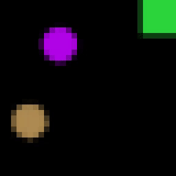

# The Billiards RL Environment

[Blog post]() | [Paper]() | [Colab notebook]()

This is a simple billiards RL environment. It is written in pure NumPy. It runs at about 300 frames per second on a 2013 MacBook Air which is comparable to or a bit faster than the OpenAI Gym Atari emulator running on the same machine. This means it's fast enough to train a deep learning agent. And one could almost certainly make it faster via different tricks. If you run it with coordinate (not pixel) observations, it is much faster.

The goal of this environment is to study the planning abilities of RL agents. Billiards is a good testbed because you can do much better in billiards when you plan ahead. If you don't plan ahead, the problem reduces to something that resembles a many-armed bandit problem, where the setup of the arms varies a lot depending on the initial conditions of the balls, making generalization near-impossible. But if you do plan ahead, then the physics of the environment are fairly easy to learn and you can generalize well to new initial conditions.

## Getting started
* Read over the [Quickstart notebook](https://github.com/greydanus/billiards/blob/main/quickstart.ipynb)
* If you want to know how the code works, read the [Tutorial notebook](https://github.com/greydanus/billiards/blob/main/tutorial.ipynb)
